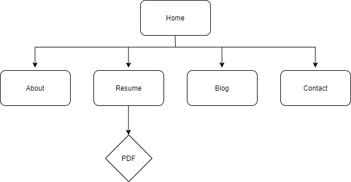

# **Portfolio** - Sevda Amini-Uhde

* [www.sevda.com.au](www.sevda.com.au)
* [Link to Github depository](https://github.com/Sevicode/portfolio_sevda)

## Purpose

The purpose of this website is to showcase my skills as a developer and an IT professional. 

This website contains a portfolio of my works during my time at Coder Academy as well as my personal projects. It also includes information about my educational background, my knowledge of programming languages and my interests. 

My aim is to continue to build this website as I further develope my skills in web development and create variety of work samples by adding my projects to my portfolio to showcase them to my future employers and clients.

## Target audiance

This portfolio website is designed to attract potential employers seeking to employ a developer, a software engineer or an IT professional. Also, I am aiming on attracting potential clients who are after a website for their businesses by showcasing my projects.

## Functionality and features

This website contains 5 pages:

1. Home page (index.html)

   An animation introductory text in the middle of the page apears following by social media icones which also are animated. The homepage is considered as a landing page for the website.

2. About page (about.html)
   This page is a brief introduction about my tech and softs skills, interests and in general who I am. Also a list of the previous projects are added in this page.

3. Resume page (resume.html)

    Resume page links to a pdf in a new window

4. Blog page (blog.html)

5. Contact page (contact.html)

    Instead of creating a contact form I prefered to only put my email address which makes it easier for the user to just click on it and send an email.

All pages of the website are produced with a responsive layout that will display on desktop, mobile and tablet devices and have been built for accessibility to all users.

Navigation menu on top right side of each page of the website makes it accessible to all pages. Links to my social account including LinkedIn, Github and Twitter are also present in all pages and by clicking on them the user will be directed to my account which will be opened on a new tab.

## Sitemap

## Wireframe Muckups

### Mobile Wireframes

### Tablet Wireframes

### Desktop Wireframes

## Screenshots

## Tech stack

This portfolio was built using:

* HTML
* CSS
* SASS
* JavaScript

**----------------------------**

* Balsamiq (for creating wireframes)
* draw.io (site map)
* Google fonts
* Font Awesome
